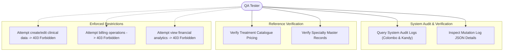

# CATMS Role-Based Use-Case Specification

This document provides a comprehensive, role-based use-case specification across all backend domains (excluding `report_pdf`) in **CATMS (Computerized Administration and Treatment Management System)**.

### Environment & Branch Assumption
For all scenarios in this document, we assume two operational clinic branches:
* **Branch 1: Colombo** (`branch_id = 1`)
* **Branch 2: Kandy** (`branch_id = 2`)

---

## 1. Role: Admin (System Administrator)

### 1.1 Overview
The **Admin** has system-wide operational and administrative authority. The Admin is not bound to a single branch; they configure master data, manage user accounts across all branches, view cross-branch audits, and evaluate national and branch-level analytics.

### 1.2 Role-Based Use-Case Diagram

```mermaid
flowchart TD
    Admin([System Admin])

    subgraph System Configuration & Master Data
        UC_Branch["Manage Branches (Colombo & Kandy)"]
        UC_RoleSpec["Manage Roles & Medical Specialties"]
        UC_TreatCat["Manage Treatment Catalogue & Global Pricing"]
    end

    subgraph Cross-Branch Staff & Account Management
        UC_StaffMgmt["Manage Staff in Colombo & Kandy"]
        UC_UserAcc["Create User Accounts & Reset Passwords"]
        UC_PromoteDoc["Promote Staff to Doctor & Assign Specialties"]
    end

    subgraph National Analytics & Security
        UC_Reports["View National & Branch Analytics (RG-1 to RG-5)"]
        UC_Audit["Inspect System-Wide Audit Logs"]
        UC_ReadRecords["Inspect Cross-Branch Invoices & Appointments"]
    end

    Admin --> UC_Branch
    Admin --> UC_RoleSpec
    Admin --> UC_TreatCat
    Admin --> UC_StaffMgmt
    Admin --> UC_UserAcc
    Admin --> UC_PromoteDoc
    Admin --> UC_Reports
    Admin --> UC_Audit
    Admin --> UC_ReadRecords
```

### 1.3 Endpoints, Example Requests, and Responses

| Domain | Endpoint | Description | Example Request | Example Response |
| :--- | :--- | :--- | :--- | :--- |
| **Auth** | `POST /auth/login` | Authenticate Admin | **Headers:** `Content-Type: application/json` **Body:** `{"username": "admin", "password": "AdminPassword123!"}` | **Status:** `200 OK` `{"access_token": "eyJhbGciOiJIUzI1Ni...", "token_type": "bearer", "user": {"staff_id": 1, "username": "admin", "role": "Admin", "branch_id": null}}` |
| **Auth** | `GET /auth/me` | Fetch active Admin profile | **Headers:** `Authorization: Bearer <token>` | **Status:** `200 OK` `{"staff_id": 1, "username": "admin", "role": "Admin", "branch_id": null, "first_name": "System", "last_name": "Administrator"}` |
| **Branches** | `GET /branches` | List all branches | **Headers:** `Authorization: Bearer <token>` **Query:** `?page=1&page_size=10` | **Status:** `200 OK` `{"data": {"items": [{"branch_id": 1, "branch_name": "Colombo", "contact_number": "+94112345678"}, {"branch_id": 2, "branch_name": "Kandy", "contact_number": "+94812345678"}], "total": 2, "page": 1, "page_size": 10}, "error": null}` |
| **Branches** | `POST /branches` | Register new facility | **Headers:** `Authorization: Bearer <token>` **Body:** `{"branch_name": "Galle", "address": "10 Wackwella Road, Galle", "contact_number": "+94912345678"}` | **Status:** `201 Created` `{"data": {"branch_id": 3, "branch_name": "Galle", "address": "10 Wackwella Road, Galle", "contact_number": "+94912345678"}, "error": null}` |
| **Staff** | `GET /staff` | List staff filtered by Kandy branch | **Headers:** `Authorization: Bearer <token>` **Query:** `?branch_id=2&page=1&page_size=10` | **Status:** `200 OK` `{"data": {"items": [{"staff_id": 14, "first_name": "Nimal", "last_name": "Perera", "job_title": "Doctor", "branch_id": 2}], "total": 1, "page": 1, "page_size": 10}, "error": null}` |
| **Staff** | `POST /staff/{staff_id}/account` | Create login credentials for staff | **Headers:** `Authorization: Bearer <token>` **Body:** `{"username": "kandy_doc1", "password": "TempDoctorPass123!", "role_id": 4}` | **Status:** `201 Created` `{"data": {"staff_id": 14, "username": "kandy_doc1", "role_id": 4, "is_active": true}, "error": null}` |
| **Staff** | `POST /staff/{staff_id}/account/reset-password` | Administrative password reset | **Headers:** `Authorization: Bearer <token>` **Body:** `{"new_password": "NewSecurePassword456!"}` | **Status:** `204 No Content` |
| **Treatment Catalogue** | `POST /treatments` | Add treatment to global catalogue | **Headers:** `Authorization: Bearer <token>` **Body:** `{"service_code": "GEN-002", "treatment_name": "General Checkup Extended", "category": "Consultation", "current_price": 4500.00}` | **Status:** `201 Created` `{"data": {"service_code": "GEN-002", "treatment_name": "General Checkup Extended", "current_price": 4500.00}, "error": null}` |
| **Reference** | `POST /specialties` | Add medical specialty | **Headers:** `Authorization: Bearer <token>` **Body:** `{"specialty_name": "Neurology"}` | **Status:** `201 Created` `{"data": {"specialty_id": 9, "specialty_name": "Neurology"}, "error": null}` |
| **Reports** | `GET /reports/appointments-summary` | Cross-branch national appointment volume | **Headers:** `Authorization: Bearer <token>` **Query:** `?from=2026-09-01&to=2026-09-30` | **Status:** `200 OK` `{"data": [{"appointment_date": "2026-09-15", "total_count": 42, "scheduled_count": 5, "completed_count": 35, "cancelled_count": 2}], "error": null}` |
| **Reports** | `GET /reports/doctor-revenue` | Revenue ranking per branch | **Headers:** `Authorization: Bearer <token>` **Query:** `?branch_id=1` | **Status:** `200 OK` `{"data": [{"branch_id": 1, "doctor_staff_id": 101, "doctor_name": "Dr. Silva", "revenue": 150000.00, "revenue_rank": 1}], "error": null}` |
| **Audit** | `GET /audit-logs` | Inspect security audit trails | **Headers:** `Authorization: Bearer <token>` **Query:** `?action_type=UPDATE&table_affected=user_account` | **Status:** `200 OK` `{"data": {"items": [{"log_id": 88, "staff_id": 1, "action_type": "UPDATE", "table_affected": "user_account", "record_id_affected": "14", "log_timestamp": "2026-09-18T10:15:00Z"}], "total": 1, "page": 1, "page_size": 10}, "error": null}` |

### 1.4 Current Restrictions & Boundary Rules
1. **No Operational Clinic Overrides:** Admins cannot register patients (`POST /patients`), book appointments (`POST /appointments`), finalize invoices (`POST /invoices/{id}/finalize`), or record payments (`POST /invoices/{id}/payments`). These endpoints strictly require the `Receptionist` role (`403 Forbidden`).
2. **No Clinical Modifications:** Admins cannot complete appointments (`POST /appointments/{id}/complete`) or create/amend treatments and consultation notes (`403 Forbidden`). These require the `Doctor` role.
3. **No Direct Guardian CRUD:** Admin receives `403 Forbidden` on `/guardians` routes, which are restricted to Receptionists.
4. **Treatment Frequency Scope Defect:** Under `GET /reports/treatment-frequency`, `branch_id` is currently omitted from router query parameters, preventing the Admin from filtering frequency by Colombo or Kandy (locked to nationwide aggregate).

---

## 2. Role: Branch Manager (Colombo / Kandy)

### 2.1 Overview
The **Branch Manager** oversees the operations, staff, and financial health of their specifically assigned facility (e.g. Colombo Branch Manager oversees `branch_id = 1`; Kandy Branch Manager oversees `branch_id = 2`).

### 2.2 Role-Based Use-Case Diagram

```mermaid
flowchart TD
    BM([Branch Manager - Colombo])

    subgraph Branch-Scoped Staff Supervision
        UC_ListStaff["List Colombo Staff"]
        UC_CreateStaff["Hire Staff into Colombo"]
        UC_EditStaff["Update Colombo Staff Profile"]
        UC_Promote["Promote Staff to Doctor & Assign Specialties"]
    end

    subgraph Branch-Scoped Operational Oversight
        UC_ViewInvoices["Monitor Colombo Invoices & Claims"]
        UC_ViewAppts["Review Colombo Appointment Schedule"]
        UC_ViewPatients["Lookup Patient Records Across Branches"]
    end

    subgraph Branch Analytics
        UC_RepAppt["Colombo Appointment Volume Summary"]
        UC_RepRev["Colombo Doctor Revenue & Ranking"]
        UC_RepDebtor["Colombo Outstanding Balances & Debtors"]
    end

    subgraph Enforced Restrictions
        ERR_CrossStaff["Attempt access to Kandy Staff -> 403 Forbidden"]
        ERR_CrossRep["Attempt query for Kandy Report -> 403 Forbidden"]
        ERR_BillingWrite["Attempt Finalize Invoice / Payment -> 403 Forbidden"]
    end

    BM --> UC_ListStaff
    BM --> UC_CreateStaff
    BM --> UC_EditStaff
    BM --> UC_Promote
    BM --> UC_ViewInvoices
    BM --> UC_ViewAppts
    BM --> UC_ViewPatients
    BM --> UC_RepAppt
    BM --> UC_RepRev
    BM --> UC_RepDebtor

    BM -.-> ERR_CrossStaff
    BM -.-> ERR_CrossRep
    BM -.-> ERR_BillingWrite
```

### 2.3 Endpoints, Example Requests, and Responses

| Domain | Endpoint | Description | Example Request | Example Response |
| :--- | :--- | :--- | :--- | :--- |
| **Staff** | `GET /staff` | List staff in own branch (Colombo) | **Headers:** `Authorization: Bearer <ColomboBM_Token>` **Query:** `?page=1&page_size=10` | **Status:** `200 OK` `{"data": {"items": [{"staff_id": 10, "first_name": "Sunil", "last_name": "Fernando", "branch_id": 1, "job_title": "Receptionist"}, {"staff_id": 101, "first_name": "Kasun", "last_name": "Silva", "branch_id": 1, "job_title": "Doctor"}], "total": 2, "page": 1, "page_size": 10}, "error": null}` |
| **Staff** | `POST /staff` | Hire new staff member into Colombo | **Headers:** `Authorization: Bearer <ColomboBM_Token>` **Body:** `{"first_name": "Amal", "last_name": "Perera", "job_title": "Receptionist", "branch_id": 1, "employment_status": "Active"}` | **Status:** `201 Created` `{"data": {"staff_id": 25, "first_name": "Amal", "last_name": "Perera", "branch_id": 1}, "error": null}` |
| **Staff** | `POST /staff/{staff_id}/doctor` | Promote Colombo staff member to Doctor | **Headers:** `Authorization: Bearer <ColomboBM_Token>` **Body:** `{"slmc_reg_no": "SLMC-89211", "consultation_fee": 3000.00}` | **Status:** `201 Created` `{"data": {"staff_id": 25, "slmc_reg_no": "SLMC-89211", "consultation_fee": 3000.00}, "error": null}` |
| **Patients** | `GET /patients` | Search patient profile (cross-branch read) | **Headers:** `Authorization: Bearer <ColomboBM_Token>` **Query:** `?search=Kamal` | **Status:** `200 OK` `{"data": {"items": [{"patient_id": 105, "first_name": "Kamal", "last_name": "Gunaratne", "registered_branch_id": 2}], "total": 1, "page": 1, "page_size": 10}, "error": null}` |
| **Appointments** | `GET /appointments` | Review Colombo appointments | **Headers:** `Authorization: Bearer <ColomboBM_Token>` **Query:** `?branch_id=1&date=2026-09-18` | **Status:** `200 OK` `{"data": {"items": [{"appointment_id": 301, "patient_id": 105, "doctor_staff_id": 101, "branch_id": 1, "status": "Scheduled"}], "total": 1, "page": 1, "page_size": 10}, "error": null}` |
| **Billing** | `GET /invoices` | Monitor Colombo invoices | **Headers:** `Authorization: Bearer <ColomboBM_Token>` **Query:** `?branch_id=1&status=Finalized` | **Status:** `200 OK` `{"data": {"items": [{"invoice_id": 701, "appointment_id": 301, "branch_id": 1, "payable_amount": 3500.00, "status": "Finalized"}], "total": 1, "page": 1, "page_size": 10}, "error": null}` |
| **Reports** | `GET /reports/outstanding-balances` | View Colombo unpaid dues report | **Headers:** `Authorization: Bearer <ColomboBM_Token>` **Query:** `?branch_id=1` | **Status:** `200 OK` `{"data": [{"invoice_id": 701, "patient_id": 105, "patient_name": "Kamal Gunaratne", "branch_id": 1, "payable_amount": 3500.00, "amount_paid": 0.00, "outstanding_amount": 3500.00}], "error": null}` |
| **Reports** | `GET /reports/doctor-revenue` | Doctor revenue ranking for Colombo | **Headers:** `Authorization: Bearer <ColomboBM_Token>` **Query:** `?from=2026-09-01&to=2026-09-30` | **Status:** `200 OK` `{"data": [{"branch_id": 1, "doctor_staff_id": 101, "doctor_name": "Dr. Kasun Silva", "revenue": 125000.00, "revenue_rank": 1}], "error": null}` |

### 2.4 Current Restrictions & Boundary Rules
1. **Strict Branch Scoping on Staff:**
   * If Colombo Branch Manager calls `GET /staff?branch_id=2` (Kandy), the API returns `403 Forbidden` (`detail: "Branch Manager can only list staff from their branch"`).
   * Calling `GET /staff/{staff_id}` or `PATCH /staff/{staff_id}` on a staff member belonging to Kandy returns `403 Forbidden` (`detail: "Staff is outside your branch"`).
   * Creating staff with `body.branch_id = 2` returns `403 Forbidden` (`detail: "Staff must belong to your branch"`).
2. **Account Management Prohibited:** Branch Managers cannot invoke `POST /staff/{id}/account` or reset passwords (`403 Forbidden` — Admin only).
3. **Branch Scoping on Reports:**
   * Omitting `branch_id` forces `user.branch_id`.
   * Passing a different branch (e.g. Colombo BM passing `?branch_id=2`) triggers `403 Forbidden` (`detail: "Branch Manager can only access their assigned branch"`).
4. **Billing & Clinical Writes Restricted:** Branch Manager has read-only access to `/invoices` and `/insurance-claims`. They cannot finalize invoices, accept payments, verify claims, or update consultation notes (`403 Forbidden`).
5. **No Audit Log Access:** Branch Managers cannot view `/audit-logs` (`403 Forbidden`).

---

## 3. Role: Doctor (Colombo / Kandy)

### 3.1 Overview
The **Doctor** delivers clinical care at their designated branch (e.g., Doctor at Colombo `staff_id = 101, branch_id = 1`). Doctors require patient medical history across all branches but must only view and alter appointments assigned directly to themselves.

### 3.2 Role-Based Use-Case Diagram

```mermaid
flowchart TD
    Doctor([Doctor - Dr. Silva Colombo])

    subgraph Cross-Branch Medical Record Access
        UC_SearchPt["Search Patient Records (Colombo & Kandy)"]
        UC_PtHistory["View Patient Medical & Appointment History"]
        UC_TreatCat["Browse Treatment Catalogue & Pricing"]
    end

    subgraph Appointment & Consultation Workflow
        UC_MyAppts["View My Assigned Appointments"]
        UC_AddTreat["Log Appointment Treatment"]
        UC_AmendTreat["Amend Recorded Treatment with Reason"]
        UC_Notes["Save Consultation & Clinical Notes"]
        UC_Complete["Mark Appointment Completed"]
    end

    subgraph Strict Ownership Boundaries
        ERR_OtherAppt["Query Another Doctor's Appt -> 404 Not Found"]
        ERR_OtherComplete["Complete Another Doctor's Appt -> 404 Not Found"]
        ERR_Billing["Access Billing / Invoicing -> 403 Forbidden"]
        ERR_PtReg["Register Patient -> 403 Forbidden"]
    end

    Doctor --> UC_SearchPt
    Doctor --> UC_PtHistory
    Doctor --> UC_TreatCat
    Doctor --> UC_MyAppts
    Doctor --> UC_AddTreat
    Doctor --> UC_AmendTreat
    Doctor --> UC_Notes
    Doctor --> UC_Complete

    Doctor -.-> ERR_OtherAppt
    Doctor -.-> ERR_OtherComplete
    Doctor -.-> ERR_Billing
    Doctor -.-> ERR_PtReg
```

### 3.3 Endpoints, Example Requests, and Responses

| Domain | Endpoint | Description | Example Request | Example Response |
| :--- | :--- | :--- | :--- | :--- |
| **Appointments** | `GET /appointments` | List Doctor's own appointments | **Headers:** `Authorization: Bearer <Doctor_Token>` **Query:** `?date=2026-09-18` | **Status:** `200 OK` `{"data": {"items": [{"appointment_id": 301, "patient_id": 105, "doctor_staff_id": 101, "appointment_date": "2026-09-18", "start_time": "09:00:00", "status": "Scheduled"}], "total": 1, "page": 1, "page_size": 10}, "error": null}` |
| **Appointments** | `GET /appointments/{appointment_id}` | Fetch specific consultation detail | **Headers:** `Authorization: Bearer <Doctor_Token>` | **Status:** `200 OK` `{"data": {"appointment_id": 301, "patient_id": 105, "doctor_staff_id": 101, "status": "Scheduled", "consultation_notes": null}, "error": null}` |
| **Patients** | `GET /patients/{patient_id}` | View patient details (even if registered in Kandy) | **Headers:** `Authorization: Bearer <Doctor_Token>` | **Status:** `200 OK` `{"data": {"patient_id": 105, "first_name": "Kamal", "last_name": "Gunaratne", "nic_passport_no": "199012345678", "gender": "Male", "registered_branch_id": 2}, "error": null}` |
| **Appointment Treatment** | `POST /appointments/{appointment_id}/treatments` | Prescribe/log treatment for consultation | **Headers:** `Authorization: Bearer <Doctor_Token>` **Body:** `{"service_code": "GEN-001"}` | **Status:** `201 Created` `{"data": {"appointment_treatment_id": 501, "appointment_id": 301, "service_code": "GEN-001", "price_at_time": 2500.00, "is_amended": false}, "error": null}` |
| **Appointment Treatment** | `POST /appointment-treatments/{id}/amend` | Amend mistakenly added treatment | **Headers:** `Authorization: Bearer <Doctor_Token>` **Body:** `{"service_code": "GEN-002", "reason": "Upgraded consultation scope upon clinical examination"}` | **Status:** `201 Created` `{"data": {"appointment_treatment_id": 502, "original_record_id": 501, "service_code": "GEN-002", "price_at_time": 4500.00, "is_amended": true}, "error": null}` |
| **Appointment Treatment** | `PATCH /appointments/{appointment_id}/notes` | Record doctor clinical notes | **Headers:** `Authorization: Bearer <Doctor_Token>` **Body:** `{"consultation_notes": "Patient reported acute pharyngitis. Prescribed Amoxicillin 500mg TDS for 5 days."}` | **Status:** `200 OK` `{"data": {"appointment_id": 301, "consultation_notes": "Patient reported acute pharyngitis. Prescribed Amoxicillin 500mg TDS for 5 days."}, "error": null}` |
| **Appointments** | `POST /appointments/{appointment_id}/complete` | Mark consultation completed (triggers draft invoice) | **Headers:** `Authorization: Bearer <Doctor_Token>` | **Status:** `200 OK` `{"data": {"appointment_id": 301, "status": "Completed"}, "error": null}` |
| **Treatment Catalogue** | `GET /treatments` | Search treatments and pricing | **Headers:** `Authorization: Bearer <Doctor_Token>` **Query:** `?category=Consultation` | **Status:** `200 OK` `{"data": {"items": [{"service_code": "GEN-001", "treatment_name": "General Consultation", "current_price": 2500.00}], "total": 1, "page": 1, "page_size": 10}, "error": null}` |

### 3.4 Current Restrictions & Boundary Rules
1. **Strict Doctor Ownership on Appointments:**
   * When calling `GET /appointments`, the backend forces `doctor_scope = user.staff_id`.
   * If Doctor passes `?doctor_id=102` (another doctor), the API returns `403 Forbidden` (`detail: "Doctors can only list their own appointments"`).
   * Calling `GET /appointments/{appointment_id}` or completing an appointment belonging to another doctor returns `404 Not Found` (deliberately masking existence to prevent doctor ID enumeration).
2. **Ownership on Clinical Writes:** Logging treatments, amending treatments, and editing consultation notes verify that the related appointment's `doctor_staff_id == user.staff_id`. If not, returns `404 Not Found`.
3. **No Patient Registration / Demographic Editing:** Doctors cannot register patients or update addresses/phones (`403 Forbidden`).
4. **No Billing Actions:** Doctors are barred from `/invoices`, `/payments`, and `/insurance-claims` (`403 Forbidden`).
5. **No Booking or Cancellation:** Doctors cannot create or cancel appointments (`403 Forbidden` — Receptionist only).

---

## 4. Role: Receptionist (Colombo / Kandy)

### 4.1 Overview
The **Receptionist** operates the clinic front desk at their assigned branch (e.g. Colombo Receptionist `branch_id = 1`; Kandy Receptionist `branch_id = 2`). The Receptionist manages patient registration, appointments, walk-in billing settlements, insurance claims, and payment collections.

### 4.2 Role-Based Use-Case Diagram

```mermaid
flowchart TD
    Rec([Receptionist - Colombo Front Desk])

    subgraph Patient Care & Walk-In Intake
        UC_SearchPt["Search Patients Colombo & Kandy (REQ-PM-2)"]
        UC_RegPt["Register Patient (Colombo Scoped)"]
        UC_EditPt["Update Colombo Patient Profile"]
        UC_Guardians["Manage National Guardians & Links"]
        UC_Insurance["Record Patient Insurance Policies"]
    end

    subgraph Appointment Scheduling
        UC_Avail["Check Doctor Slot Availability"]
        UC_BookAppt["Book Appointment (Colombo Branch)"]
        UC_CancelAppt["Cancel Scheduled Appointment"]
    end

    subgraph Billing & Settlement Execution
        UC_ViewInv["Query Invoices & Unpaid Patient Dues"]
        UC_Claim["File & Verify Insurance Claim"]
        UC_Finalize["Finalize Draft Invoice (Colombo Scoped)"]
        UC_Payment["Record Cash/Card Payment (Colombo Scoped)"]
    end

    subgraph Enforced Restrictions
        ERR_EditKandyPt["Attempt update of Kandy Patient -> 403 Forbidden"]
        ERR_KandyFin["Attempt finalize of Kandy Invoice -> 403 Forbidden"]
        ERR_DocAction["Attempt complete appointment -> 403 Forbidden"]
    end

    Rec --> UC_SearchPt
    Rec --> UC_RegPt
    Rec --> UC_EditPt
    Rec --> UC_Guardians
    Rec --> UC_Insurance
    Rec --> UC_Avail
    Rec --> UC_BookAppt
    Rec --> UC_CancelAppt
    Rec --> UC_ViewInv
    Rec --> UC_Claim
    Rec --> UC_Finalize
    Rec --> UC_Payment

    Rec -.-> ERR_EditKandyPt
    Rec -.-> ERR_KandyFin
    Rec -.-> ERR_DocAction
```

### 4.3 Endpoints, Example Requests, and Responses

| Domain | Endpoint | Description | Example Request | Example Response |
| :--- | :--- | :--- | :--- | :--- |
| **Patients** | `POST /patients` | Register patient at Colombo desk | **Headers:** `Authorization: Bearer <ColomboRec_Token>` **Body:** `{"first_name": "Ruwan", "last_name": "Dias", "nic_passport_no": "199411223344", "date_of_birth": "1994-05-12", "gender": "Male", "address": "45 Havelock Road, Colombo 05"}` | **Status:** `201 Created` `{"data": {"patient_id": 110, "first_name": "Ruwan", "last_name": "Dias", "registered_branch_id": 1}, "error": null}` |
| **Patients** | `GET /patients` | Cross-branch patient search (finds Kandy patient) | **Headers:** `Authorization: Bearer <ColomboRec_Token>` **Query:** `?search=199012345678` | **Status:** `200 OK` `{"data": {"items": [{"patient_id": 105, "first_name": "Kamal", "last_name": "Gunaratne", "registered_branch_id": 2}], "total": 1, "page": 1, "page_size": 10}, "error": null}` |
| **Patients** | `PATCH /patients/{patient_id}` | Update patient registered at Colombo | **Headers:** `Authorization: Bearer <ColomboRec_Token>` **Body:** `{"address": "90 Baseline Road, Colombo 09"}` | **Status:** `200 OK` `{"data": {"patient_id": 110, "address": "90 Baseline Road, Colombo 09"}, "error": null}` |
| **Guardians** | `POST /guardians` | Create guardian profile | **Headers:** `Authorization: Bearer <ColomboRec_Token>` **Body:** `{"first_name": "Sunethra", "last_name": "Dias", "nic": "197055443322", "address": "45 Havelock Road, Colombo 05"}` | **Status:** `201 Created` `{"data": {"guardian_id": 52, "first_name": "Sunethra", "last_name": "Dias"}, "error": null}` |
| **Appointments** | `GET /appointments/availability` | Check Dr. Silva's slots in Colombo | **Headers:** `Authorization: Bearer <ColomboRec_Token>` **Query:** `?doctor_id=101&date=2026-09-20` | **Status:** `200 OK` `{"data": {"doctor_id": 101, "date": "2026-09-20", "available_slots": ["09:00", "09:30", "10:00", "11:30"]}, "error": null}` |
| **Appointments** | `POST /appointments` | Book appointment at Colombo | **Headers:** `Authorization: Bearer <ColomboRec_Token>` **Body:** `{"patient_id": 105, "doctor_staff_id": 101, "appointment_date": "2026-09-20", "start_time": "09:00:00"}` | **Status:** `201 Created` `{"data": {"appointment_id": 305, "branch_id": 1, "patient_id": 105, "doctor_staff_id": 101, "status": "Scheduled"}, "error": null}` |
| **Billing** | `GET /invoices` | Lookup unpaid invoices for walk-in patient | **Headers:** `Authorization: Bearer <ColomboRec_Token>` **Query:** `?patient_id=105` | **Status:** `200 OK` `{"data": {"items": [{"invoice_id": 701, "appointment_id": 301, "branch_id": 1, "patient_id": 105, "payable_amount": 5500.00, "outstanding_amount": 5500.00, "status": "Draft"}], "total": 1, "page": 1, "page_size": 10}, "error": null}` |
| **Billing** | `POST /invoices/{invoice_id}/claim` | File insurance claim for draft invoice | **Headers:** `Authorization: Bearer <ColomboRec_Token>` **Body:** `{"policy_id": "SLIC-POL-9921", "claimed_amount": 3000.00}` | **Status:** `201 Created` `{"data": {"claim_id": 81, "invoice_id": 701, "claimed_amount": 3000.00, "verification_status": "Pending"}, "error": null}` |
| **Billing** | `POST /insurance-claims/{claim_id}/verify` | Verify insurance claim approval | **Headers:** `Authorization: Bearer <ColomboRec_Token>` | **Status:** `200 OK` `{"data": {"claim_id": 81, "approved_amount": 3000.00, "verification_status": "Approved"}, "error": null}` |
| **Billing** | `POST /invoices/{invoice_id}/finalize` | Finalize invoice applying insurance deduction | **Headers:** `Authorization: Bearer <ColomboRec_Token>` **Body:** `{"insurance_deduction": 3000.00, "manual_discount": 500.00}` | **Status:** `200 OK` `{"data": {"invoice_id": 701, "subtotal_amount": 5500.00, "insurance_deduction": 3000.00, "manual_discount": 500.00, "payable_amount": 2000.00, "outstanding_amount": 2000.00, "status": "Finalized"}, "error": null}` |
| **Billing** | `POST /invoices/{invoice_id}/payments` | Record patient cash payment | **Headers:** `Authorization: Bearer <ColomboRec_Token>` **Body:** `{"amount_paid": 2000.00, "payment_method": "Cash"}` | **Status:** `201 Created` `{"data": {"payment_id": 901, "invoice_id": 701, "amount_paid": 2000.00, "payment_method": "Cash"}, "error": null}` |

### 4.4 Current Restrictions & Boundary Rules
1. **Patient Write Scoping:**
   * Patient registration derives `registered_branch_id` from the Receptionist's token (`user.branch_id`). The client cannot specify a different branch.
   * `PATCH /patients/{id}` enforces `registered_branch_id == user.branch_id`. If Colombo Receptionist attempts to edit Kandy-registered Patient 105, the API returns `403 Forbidden` (`detail: "Patient is outside your branch"`).
   * Modifying patient phones, guardians, or insurance similarly enforces home branch ownership (`403 Forbidden` on mismatch).
2. **Appointment Booking Branch Isolation:**
   * When booking (`POST /appointments`), `branch_id` is derived from `user.branch_id` (Colombo).
   * The selected doctor must belong to Colombo; selecting a Kandy doctor results in `422 Unprocessable Entity`.
3. **Billing Write Scoping:**
   * Finalizing an invoice, creating a payment, creating a claim, or verifying a claim enforces that the related appointment belongs to the Receptionist's branch (`a.branch_id == user.branch_id`). If Colombo Receptionist attempts to finalize a Kandy invoice, the API returns `403 Forbidden` (`detail: "Invoice is outside your branch"`).
4. **Current Discrepancy & Least Privilege Recommendation on Reports:**
   * In `GET /reports/outstanding-balances`, Receptionists currently bypass branch checking if `branch_id` is omitted, returning system-wide debtor rosters across Colombo and Kandy.
   * **Recommendation Applied:** As documented in `auth-audit.md`, Receptionists only require balance details for an individual patient standing at their counter. Therefore, querying should either strictly require `patient_id` or scope general queries to `user.branch_id`. Cross-branch patient balance lookups should be served via `GET /invoices?patient_id=X`.

---

## 5. Role: QA Tester

### 5.1 Overview
The **QA Tester** validates system integrity, audit logging compliance, and database consistency. The QA Tester has read access to audit logs and catalog reference data across both branches to verify system behavior.

### 5.2 Role-Based Use-Case Diagram

### 5.3 Endpoints, Example Requests, and Responses

| Domain | Endpoint | Description | Example Request | Example Response |
| :--- | :--- | :--- | :--- | :--- |
| **Audit** | `GET /audit-logs` | Filter audit trail by affected table | **Headers:** `Authorization: Bearer <QA_Token>` **Query:** `?table_affected=invoice&page=1&page_size=10` | **Status:** `200 OK` `{"data": {"items": [{"log_id": 92, "staff_id": 10, "action_type": "UPDATE", "table_affected": "invoice", "record_id_affected": "701", "log_timestamp": "2026-09-18T11:20:00Z"}], "total": 1, "page": 1, "page_size": 10}, "error": null}` |
| **Audit** | `GET /audit-logs/{log_id}` | Inspect detailed payload changes | **Headers:** `Authorization: Bearer <QA_Token>` | **Status:** `200 OK` `{"data": {"log_id": 92, "staff_id": 10, "action_type": "UPDATE", "table_affected": "invoice", "record_id_affected": "701", "details": "status changed from Draft to Finalized; insurance_deduction=3000.00"}, "error": null}` |
| **Treatment Catalogue** | `GET /treatments` | Audit treatment catalogue items | **Headers:** `Authorization: Bearer <QA_Token>` | **Status:** `200 OK` `{"data": {"items": [{"service_code": "GEN-001", "treatment_name": "General Consultation", "current_price": 2500.00}], "total": 1, "page": 1, "page_size": 10}, "error": null}` |
| **Reference** | `GET /specialties` | Audit medical specialties | **Headers:** `Authorization: Bearer <QA_Token>` | **Status:** `200 OK` `{"data": {"items": [{"specialty_id": 1, "specialty_name": "General Medicine"}], "total": 1, "page": 1, "page_size": 10}, "error": null}` |

### 5.4 Current Restrictions & Boundary Rules
1. **Zero Write Permissions on Business Records:** The QA Tester cannot create, edit, or delete patients, appointments, billing invoices, payments, or treatments (`403 Forbidden`).
2. **No Access to Financial Reports:** QA Tester receives `403 Forbidden` on all routes under `/reports/*`.
3. **No Staff or Account Administration:** Cannot access `/staff` or account management endpoints (`403 Forbidden`).
4. **Audit Query Validation:** In `GET /audit-logs`, if `from > to` timestamp is supplied, the API validates the parameters and returns `422 Unprocessable Entity`.

---

## 6. Comprehensive Cross-Role Permission Matrix

| Domain & Operation | Admin | Branch Manager | Doctor | Receptionist | QA Tester | Branch Isolation & Ownership Enforcement |
| :--- | :---: | :---: | :---: | :---: | :---: | :--- |
| **Branches: List / Get** | ✅ | ✅ | ✅ | ✅ | ✅ | Unrestricted read. |
| **Branches: Create / Update** | ✅ | ❌ | ❌ | ❌ | ❌ | Admin only (`403`). |
| **Staff: List Staff** | ✅ | ⚠️ | ❌ | ❌ | ❌ | Admin: any branch; BM: own branch only (`403` on mismatch). |
| **Staff: Create / Update Staff** | ✅ | ⚠️ | ❌ | ❌ | ❌ | BM restricted to own branch (`403`). |
| **Staff: Manage Accounts & Reset PW** | ✅ | ❌ | ❌ | ❌ | ❌ | Admin only (`403`). |
| **Patients: Search / View Profile** | ✅ | ✅ | ✅ | ✅ | ❌ | Cross-branch read allowed (`REQ-PM-2`, `SAFE-5`). |
| **Patients: Register Patient** | ❌ | ❌ | ❌ | ⚠️ | ❌ | Receptionist only; branch forced from user (`user.branch_id`). |
| **Patients: Update Patient Profile** | ❌ | ❌ | ❌ | ⚠️ | ❌ | Receptionist only; must match home branch (`403`). |
| **Guardians: CRUD** | ❌ | ❌ | ❌ | ✅ | ❌ | Receptionist exclusive domain. |
| **Appointments: List** | ✅ | ✅ | ⚠️ | ✅ | ❌ | Doctor scoped to own appointments (`doctor_scope = user.staff_id`). |
| **Appointments: Book** | ❌ | ❌ | ❌ | ⚠️ | ❌ | Receptionist only; forced to caller's branch. |
| **Appointments: Complete** | ❌ | ❌ | ⚠️ | ❌ | ❌ | Doctor only; must be assigned doctor (`404` on mismatch). |
| **Treatments: Prescribe / Amend** | ❌ | ❌ | ⚠️ | ❌ | ❌ | Doctor only; must be assigned doctor. |
| **Consultation Notes: Update** | ❌ | ❌ | ⚠️ | ❌ | ❌ | Doctor only; must be assigned doctor. |
| **Billing: List Invoices / Claims** | ✅ | ✅ | ❌ | ✅ | ❌ | Read access; Doctors/QA receive `403`. |
| **Billing: Finalize / Pay / Claim** | ❌ | ❌ | ❌ | ⚠️ | ❌ | Receptionist only; appointment branch must match user (`403`). |
| **Reports: Analytics (RG-1, 2, 4, 5)** | ✅ | ⚠️ | ❌ | ❌ | ❌ | BM forced to own branch (`403` on mismatch). |
| **Reports: Outstanding Balances (RG-3)**| ✅ | ⚠️ | ❌ | ⚠️ | ❌ | BM forced to branch; Receptionist recommended patient-scoped. |
| **Audit: View Audit Logs** | ✅ | ❌ | ❌ | ❌ | ✅ | Admin and QA Tester only. |
